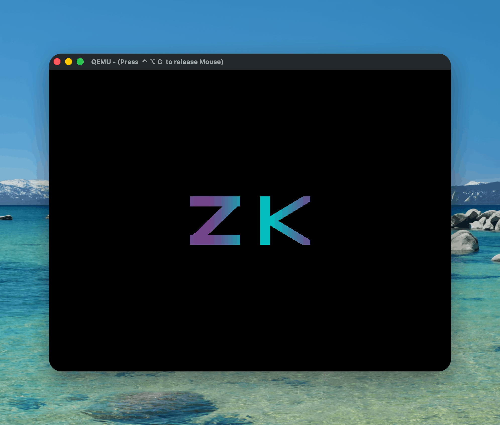
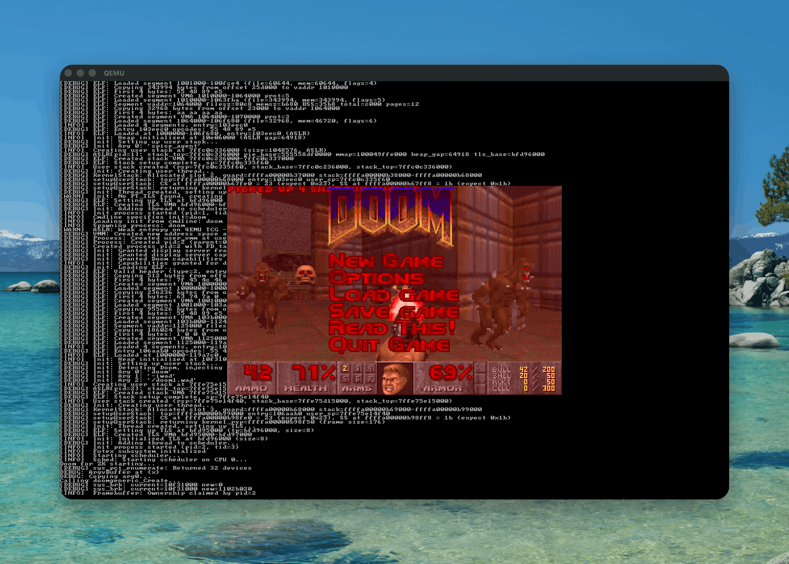

# ZK

[](https://github.com/whit3rabbit/zigk/actions/workflows/build-iso.yml)
[](https://github.com/whit3rabbit/zigk/actions/workflows/ci.yml)

> Built with **Zig 0.16.x** (nightly). See [ziglang.org/download](https://ziglang.org/download/) for installation.

ZK is a 64-bit modular monolithic operating system kernel written in Zig. It targets both **x86_64** (AMD64) and **AArch64** (ARMv8-A) architectures, featuring a custom UEFI bootloader and a unified Hardware Abstraction Layer (HAL).

Device drivers, the network stack, and file system logic run in kernel space (Ring 0 / EL1) to maximize performance and simplify hardware access.

<p align="center">
  
  
</p>

## Architecture

- **Privilege Level:** Drivers (Network, Storage, GPU) and the TCP/IP stack execute in Ring 0 (x86) or EL1 (ARM).
- **Memory Model:** Higher Half Direct Map (HHDM) for physical memory access.
- **System Calls:** Linux-compatible syscall ABI (`syscall` instruction / `svc #0`) rather than IPC message passing.
- **Further reading:** [docs/BOOT.md](docs/BOOT.md), [docs/BOOT_ARCHITECTURE.md](docs/BOOT_ARCHITECTURE.md), [docs/FILESYSTEM.md](docs/FILESYSTEM.md)

## Features

Full details in [docs/FEATURES.md](docs/FEATURES.md).

### Core

- **Dual-arch:** Single codebase for x86_64 and AArch64 with a zero-cost HAL.
- **Security:** KASLR, stack canaries, hardware entropy (RDRAND/FEAT_RNG), SMAP/PAN user/kernel isolation, capability-based access control.
- **Memory:** HHDM, IOMMU protection (VT-d), slab-like kernel heap allocator.
- **Scheduler:** Preemptive multitasking with per-CPU run queues.
- **Syscalls:** 269 Linux-compatible syscalls including `io_uring`, `epoll`, `signalfd`, `eventfd`, `timerfd`.

### Networking

- **Zero-copy TCP/IP** stack (RFC 793) with NAPI-style interrupt coalescing.
- **Drivers:** Intel E1000e (PCIe), VirtIO-Net, Loopback.
- **Protocols:** IPv4, TCP, UDP, ARP, ICMP, DNS, mDNS, DHCP.

### Storage and Filesystems

- **AHCI (SATA):** DMA scatter/gather, async I/O via kernel reactor.
- **Filesystems:** InitRD (USTAR, read-only), SFS (simple writable), ext2 (read/write), DevFS, VFS layer.
- **VirtIO-9P:** Host-guest shared folders.

### Graphics and Userspace

- **Graphics:** VirtIO-GPU 2D acceleration, UEFI framebuffer, Bochs BGA, Cirrus, QXL.
- **Audio:** Intel HDA and AC97 drivers.
- **Doom:** Runs vanilla Doom with music and sound effects.
- **Userspace:** ELF64 loader, musl-like libc, interactive shell.

### Hardware

- **USB:** Native xHCI (USB 3.0) and EHCI (USB 2.0).
- **Input:** PS/2 keyboard, USB HID.
- **Serial:** 16550 UART (x86), PL011 (ARM).

## Requirements

- [Zig 0.16.x](https://ziglang.org/download/)
- [QEMU](https://www.qemu.org/) (for emulation)
- xorriso (for ISO generation)

## Quick Start

```bash
# Build and run (defaults to x86_64, boots Doom)
make run

# Build and run the shell
make run-shell

# Build for AArch64
make build ARCH=aarch64

# Run tests
make test

# See all targets
make help
```

Or use `zig build` directly:

```bash
zig build -Darch=x86_64              # Build kernel
zig build run -Darch=x86_64          # Build and run in QEMU
zig build iso -Darch=x86_64          # Build bootable UEFI ISO
zig build test                        # Run unit tests
```

The build system produces architecture-named binaries (`kernel-x86_64.elf`, `kernel-aarch64.elf`) that coexist in `zig-out/bin/`.

## Running with QEMU

The build system configures QEMU automatically: networking (user mode with port 8080 forwarded to guest 80), KVM/HVF acceleration, and device flags.

| Option | Example |
| :--- | :--- |
| Boot target | `-Ddefault-boot=shell` (shell, doom, test_runner) |
| Firmware override | `-Dbios=/path/to/OVMF.fd` |
| Disk boot | `-Drun-iso=false` |
| Headless | `-Dheadless=true` |
| Shared folder | `-Dvirtfs=/tmp/share` |
| Serial console | `-Dqemu-args="-nographic"` (Ctrl+A X to exit) |

<details>
<summary>Running Doom</summary>

Download the shareware WAD file and place it in the initrd:

```bash
wget https://github.com/Akbar30Bill/DOOM_wads/raw/refs/heads/master/doom.wad -O initrd_contents/doom1.wad
```

Then build and run:

```bash
make run                             # x86_64 (default boot is Doom)
make run ARCH=aarch64                # or on AArch64
```

See [docs/DOOM.md](docs/DOOM.md) for controls, audio setup, and troubleshooting.

</details>

## Testing

~492 integration tests across 29 files, covering syscalls, filesystem operations, and regressions. Both architectures fully passing.

```bash
make test                # Run tests for default arch (x86_64)
make test ARCH=aarch64   # Run tests for AArch64
make test-both           # Run tests for both architectures
make test-unit           # Run Zig unit tests
```

See [docs/BUILD.md](docs/BUILD.md) for CI and Docker-based builds.

## Docker

```bash
make docker-build        # Build the container
make docker-run          # Build kernel inside Docker
```

Or manually:

```bash
docker build -t zk-builder .
docker run --rm -v $(pwd):/workspace zk-builder zig build -Darch=x86_64
```

## Documentation

| Document | Description |
| :--- | :--- |
| [docs/FEATURES.md](docs/FEATURES.md) | Full feature list |
| [docs/BUILD.md](docs/BUILD.md) | Build system, Docker, CI |
| [docs/BOOT.md](docs/BOOT.md) | Boot flow |
| [docs/BOOT_ARCHITECTURE.md](docs/BOOT_ARCHITECTURE.md) | Memory layout |
| [docs/MEMORY.md](docs/MEMORY.md) | Memory management |
| [docs/FILESYSTEM.md](docs/FILESYSTEM.md) | HAL boundary, directory map |
| [docs/SYSCALL.md](docs/SYSCALL.md) | Syscall reference (269 syscalls) |
| [docs/MISSING_SYSCALLS.md](docs/MISSING_SYSCALLS.md) | Unimplemented syscalls |
| [docs/DRIVERS.md](docs/DRIVERS.md) | Driver documentation |
| [docs/GRAPHICS.md](docs/GRAPHICS.md) | Graphics subsystem |
| [docs/KEYBOARD.md](docs/KEYBOARD.md) | Keyboard input handling |
| [docs/ASYNC.md](docs/ASYNC.md) | Async I/O and io_uring |
| [docs/network.md](docs/network.md) | Network stack |
| [docs/DOOM.md](docs/DOOM.md) | Doom port setup and usage |
| [docs/PLANNED_FEATURES.md](docs/PLANNED_FEATURES.md) | Planned features |
| [docs/ZIG.md](docs/ZIG.md) | Zig language notes |

## License

MIT License
